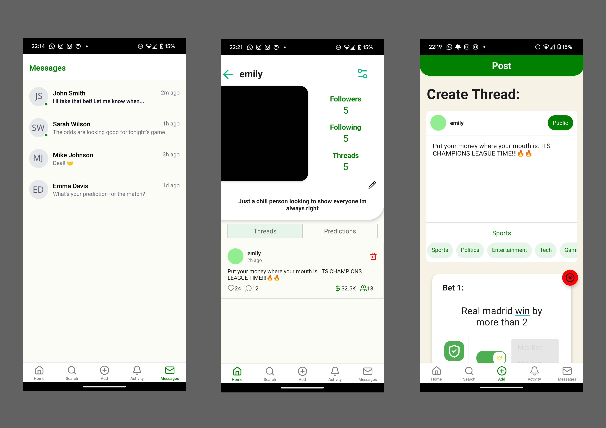

# 📱 BetSocial

## Overview

**BetSocial** is a social-media-inspired application where users can create, share, and participate in prediction-based challenges and bets with friends or the wider community.

The platform combines:
- Social networking features
- Real-time messaging
- Community interaction
- Competitive prediction systems
- User-generated betting topics

BetSocial was designed to explore scalable backend architecture, real-time communication systems, and interactive social application design.

---

# 🚀 Features

## 👥 Social Features

- User profiles
- Friend system
- Friend requests
- Social interaction between users
- Community-driven engagement

---

## 💬 Messaging System

The application supports:

### Direct Messaging
- One-to-one conversations
- Real-time communication

### Group Messaging - IN WORKS
- Multi-user chat rooms
- Social discussion around predictions and events

---

## 🎯 Prediction / Betting System

Users can create bets and prediction challenges on a wide range of topics, including:

- Sports events
- Gaming outcomes
- Real-world events
- Community challenges
- Personal/friend group predictions

The system focuses on social interaction and engagement rather than real-money gambling.

---

# 🧠 Core Concepts

## User-Created Bets

Users can:
- Create custom predictions
- Define outcomes
- Invite friends to participate
- Track results

---

## Community Interaction

The platform encourages:
- Discussion around predictions
- Competitive engagement
- Social sharing
- Community participation

---

# 🏗️ Architecture

## Backend

Built using:

- Spring Boot
- Java
- REST APIs
- Authentication systems
- Scalable service architecture

---

## Frontend

Planned frontend technologies include:

- React.js
- React Native

Supporting:
- Cross-platform development
- Responsive UI design
- Mobile-friendly interaction

---

# 🔐 Authentication

The project includes authentication support designed for:
- Secure user login
- Session management
- Protected routes and APIs

---

# 📡 API Design

The backend is structured around RESTful API principles for:
- User management
- Messaging
- Friend systems
- Prediction management
- Social interaction features

---

# 🛠️ Technologies Used

| Technology | Purpose |
|---|---|
| Java | Backend development |
| Spring Boot | API and server framework |
| React.js | Web frontend |
| React Native | Mobile frontend |
| REST APIs | Client-server communication |

---

# ⚙️ Setup & Installation

## Requirements

- Java 17+
- Node.js
- npm
- IntelliJ IDEA / VS Code
- MySQL or PostgreSQL (depending on configuration)

---

## Clone Repository

```bash
git clone https://github.com/Konkz7/BetSocial
```

---

## Backend Setup

### Navigate to backend folder

```bash
cd backend
```

### Run Spring Boot application

```bash
./mvnw spring-boot:run
```

or

```bash
mvn spring-boot:run
```

---

## Frontend Setup

### Navigate to frontend folder

```bash
cd frontend
```

### Install dependencies

```bash
npm install
```

### Start application

```bash
npm start
```

---

# 📸 Screenshots

<p align="center">
  
</p>

---

# 🔮 Potential Future Features

Potential future additions include:

- Real-time notifications
- Live event tracking
- AI-generated predictions
- Advanced recommendation systems
- Payment integration systems
- Cryptocurrency support
- Leaderboards and ranking systems
- Matchmaking and community events

---

# 💡 What I Learned

This project helped develop experience with:

- Full-stack application architecture
- REST API development
- Real-time messaging systems
- Authentication and security
- Social media application design
- Scalable backend systems
- Frontend/backend integration
- Mobile-focused development

---

# 👤 Author

Created by Amara Okonkwo.
